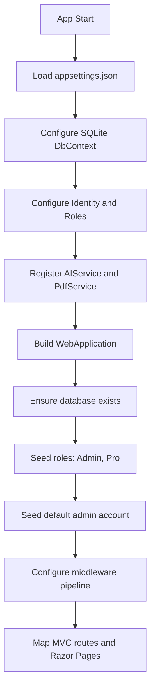
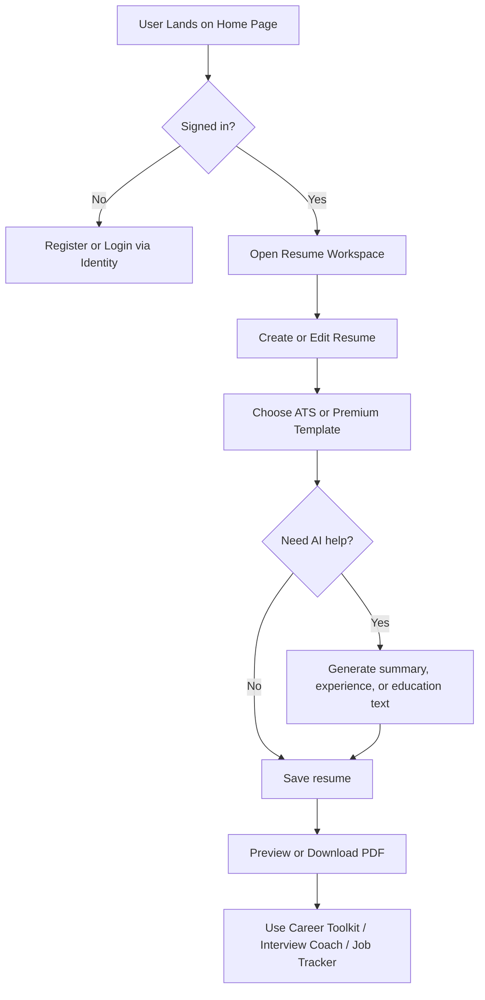
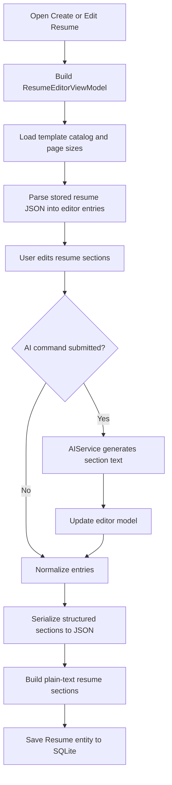
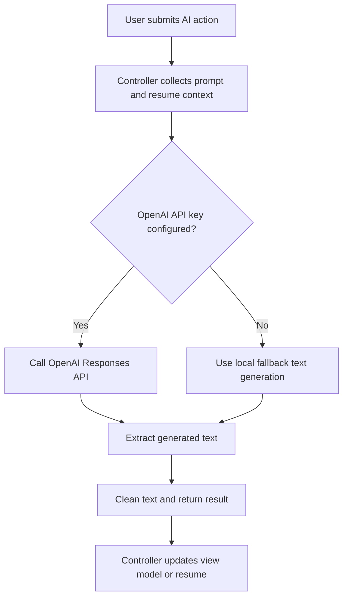
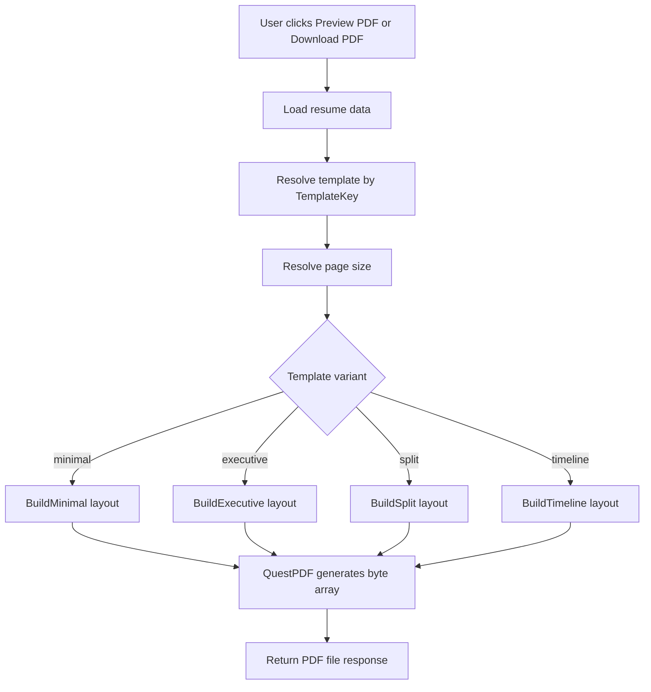
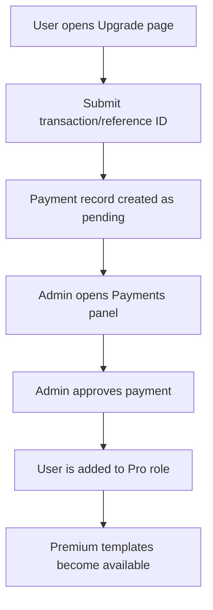
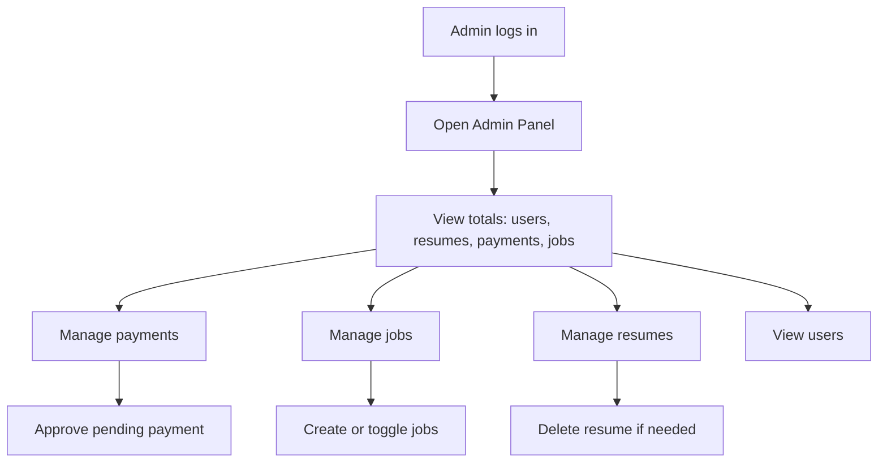

# ResuniqAI

ResuniqAI is an ASP.NET Core MVC web app for building resumes, generating AI-assisted content, exporting PDFs, managing user profiles, and handling premium template access through admin-approved payments.

## Tech Stack

- ASP.NET Core MVC on `.NET 10`
- ASP.NET Core Identity with roles (`Admin`, `Pro`)
- Entity Framework Core with SQLite
- QuestPDF for PDF generation
- OpenAI Responses API with local fallback generation when no API key is configured

## Solution Structure

- Root folder - active web application project
- `Controllers/` - MVC request flow
- `Services/` - AI and PDF services
- `Data/` - EF Core context and migrations
- `Models/` - database entities
- `ViewModels/` - page/editor view models
- `Helpers/` - template and page-size catalogs
- `Views/` - Razor views

## Process Flow

### 1. Application Startup Flow



### 2. User Journey Flow



### 3. Resume Builder Process



### 4. AI Feature Process



### 5. PDF Generation Process



### 6. Premium Upgrade Process



### 7. Admin Process



## Main Functional Areas

### Resume Management

- Users can create, edit, list, and download resumes.
- Resume sections support both legacy text fields and structured JSON-backed editor entries.
- Template selection is built into the editor workflow.

Key files:

- `Controllers/ResumeController.cs`
- `ViewModels/ResumeEditorViewModel.cs`
- `Helpers/ResumeTemplateCatalog.cs`
- `Services/PdfService.cs`

### AI Features

- Resume summary generation
- Experience bullet generation
- Achievement highlight generation
- Education description generation
- Cover letter generation
- ATS scoring
- Interview question generation
- Interview answer scoring
- Writing exam scoring

Key files:

- `Services/AIService.cs`
- `Controllers/FeaturesController.cs`
- `Controllers/AIController.cs`

### User Profile

- Stores profile details like headline, phone, portfolio, GitHub, LinkedIn, and bio.
- Displays recent resumes and payment history in the profile dashboard.

Key file:

- `Controllers/ProfileController.cs`

### Admin and Payments

- Admin can approve payments.
- Approval upgrades the user to the `Pro` role.
- Admin can manage jobs, resumes, users, and basic revenue metrics.

Key files:

- `Controllers/AdminController.cs`
- `Controllers/PaymentController.cs`

## Database Entities

- `Resume`
- `Payment`
- `Subscription`
- `JobPosting`
- `UserProfile`
- ASP.NET Identity tables for users and roles

Defined in:

- `Data/ApplicationDbContext.cs`
- `Models/`

## Configuration

Application settings are stored in:

- `appsettings.json`
- `appsettings.Development.json`

Important configuration:

- SQLite connection string: `DefaultConnection`
- OpenAI settings:
  - `OpenAI:ApiKey`
  - `OpenAI:Model`
  - `OpenAI:BaseUrl`

## Run Locally

From the solution root:

```powershell
dotnet run --project .\ResuniqAI.csproj
```

Default local URLs from launch settings:

- `http://localhost:5160`
- `https://localhost:7073`

## Current Notes

- The active web project now runs directly from the repository root at `ResuniqAI.csproj`.
- The app seeds a default admin account during startup.
- Premium access is controlled by the `Pro` role.
- If no OpenAI API key is set, AI features still work with local fallback content generation.
